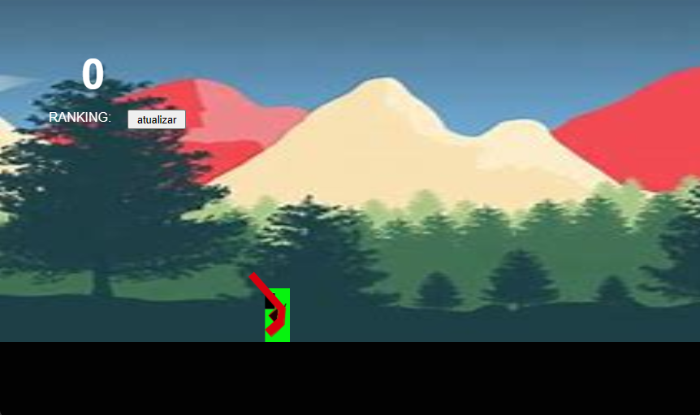

# jogo-trabalho

# Jogo criado como um projeto de faculdade.
O intuito do jogo é você sobreviver o maior tempo possivel matando a maior quantidade de inimigos possivel.
A cada inimigo matado você ganha um total de 5 pontos acumulativo.
Ao final de sua vida ou seja quando um inimigo encostar em você, será aberto uma caixa onde você colocara seu nome para que fique resgistrado no banco de dado e no ranking do jogo.
# Jogabilidade:
Você pode tanto usar as teclas A, W e D para se movimentar quanto <, ^ e >, com o mouse vc movimenta a arma e com o botão direito atira.

# LINK PARA O JOGO:

https://brilliant-taiyaki-7cf2da.netlify.app/

